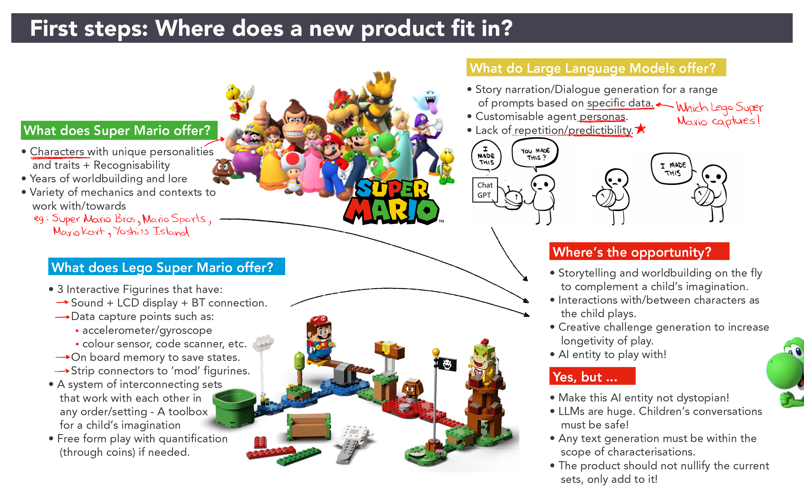
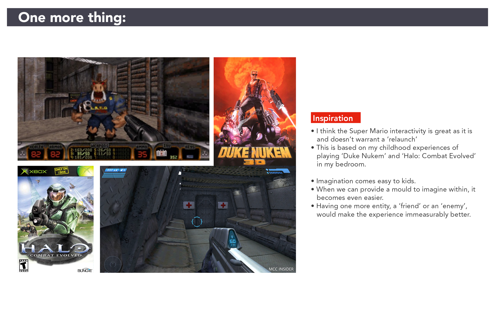
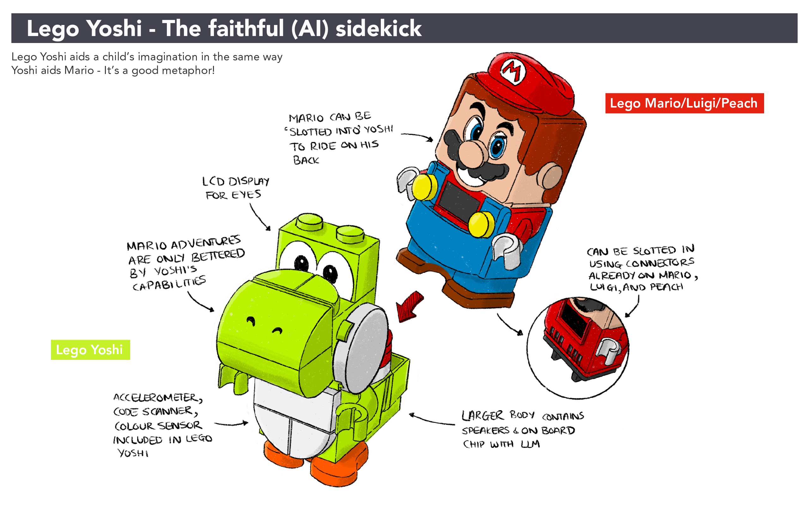
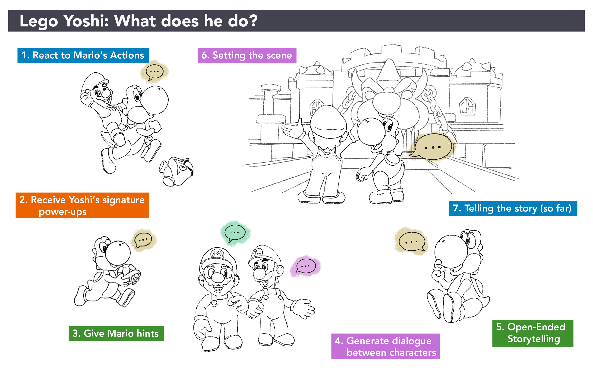
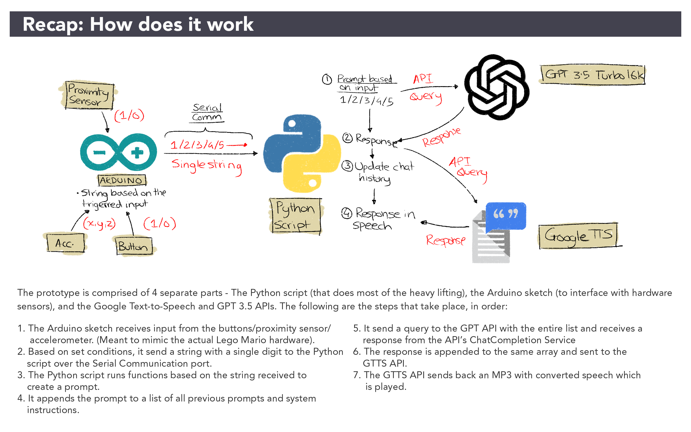
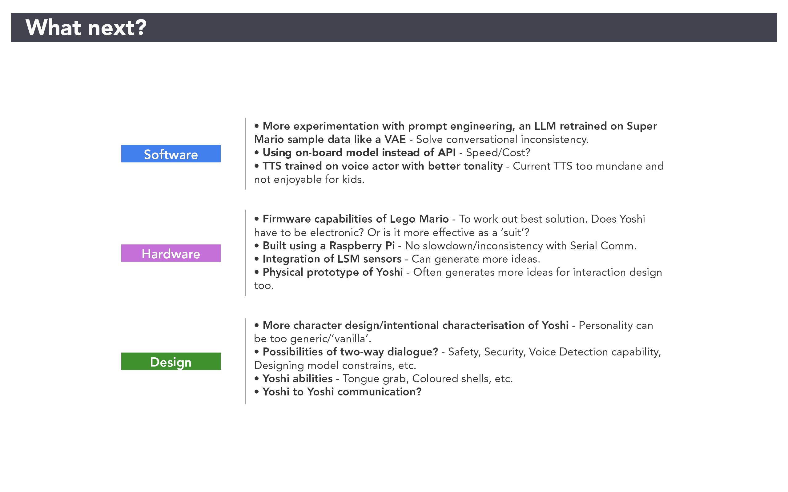
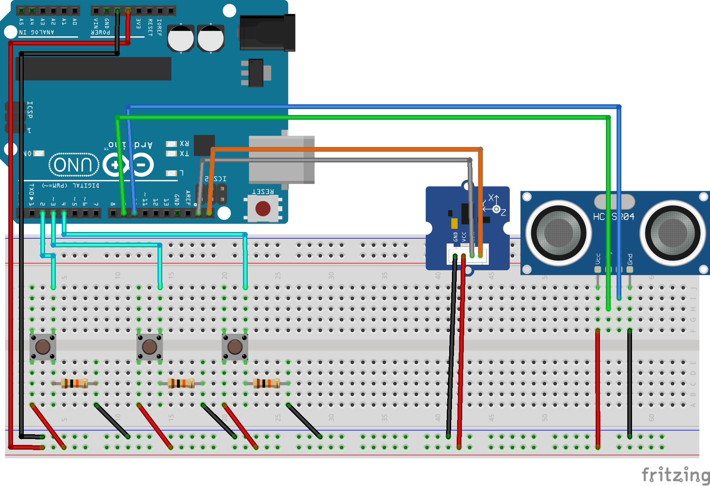

# Lego Yoshi - Lego Super Mario Interactivity
Advait Ukidve - September 2023     

**Description:** Repository to save code for YoshiBot, a proposed expansion to the Lego Super Mario interactivity using OpenAI's GPT 3.5 Turbo API.     
**This Repository:**    
- [LSM_Software_Prototype](./LSM_Software_Prototype.ipynb) contains the full code used in the software presentation. This runs with no prerequisites save installation of the relevant packages on the system (indicated in code at the top).
- [LSM_Arduino_Prototype](./LSM_Arduino_Prototype.ipynb) contains the presentation version with limited functionality and requires hardware to run.
- [This folder](./Python/) contains the same code prototypes in .py format to be run using the Python console. These contain the same functionality but without the interactivity.
- [This folder](./LSM_Lego_Yoshi_Arduino/) contains the Arduino code to be run on the Arduino.
- [This](./Presentation/LSM_Presentation.pdf) is the presentation used for the Case Study Review Round 2 Interview scheduled Tuesday 26 September 2023 at 16:00 BST.

## Presentation
     
 Where does the new product fit in? What does the current interactivity experience offer? What is the opportunity? What are the predicted pitfalls?     
     
     
 Before I get into the concept: My source of inpiration lies in my childhood experience playing 'Duke Nukem' and 'Halo: Combat Evolved' without my PC    
      
     
 The concept - Lego Yoshi - The perfect (AI) Sidekick to Lego Mario     
      
     
 Lego Yoshi - Use Cases - What could Lego Yoshi add to the experience? In what way?    
      
     
 Technical Diagram - How does the prototype work?       
      
     
 How would I take the prototype to the next level?        
      
   
## How to Run
- **Software Prototype:** Download the .ipynb file and run in [Jupyter Notebook](https://jupyter.org/) locally or on [Google Colab](https://colab.google/) OR download the .py file and run using Python console
- **Hardware Prototype:** Download the Arduino files in this folder and upload them to the Arduino device (Built using [Leonardo](https://docs.arduino.cc/hardware/leonardo), but should work with most Arduino models). Download the .ipynb/.py file and run locally using Jupyter Notebook or Python Console. This cannot be run on Colab as it requires connection to the hardware. Use the following diagram (made using [Fritzing](https://fritzing.org/)) to wire up the various components:

. 
 Full resolution version [here](./Schematics_bb.png) 

*Note: Both the Python file and Arduino code assume a Windows system with the Arduino connected to COM3 at a baudrate of 9600. Make the appropriate changes if necessary.*

# Example Responses   

## Shown in Arduino Prototype

#### 1 - Setting the Scene   
**Prompt:** *Describe a scene in Peach's Castle with Luigi and Toad before an adventure that will involve Donkey Kong, koopa troopas, Bowser Jr. and a pool of lava. Don't describe the actual adventure. Use upto 300 words.*    
   
**Response:** Oh, Mario! Let me tell you about the fun-filled scene at Peach's Castle with Luigi and Toad before our big adventure! It was a bright and beautiful day in the Mushroom Kingdom, with colorful flowers blooming all around. The castle courtyard was bustling with excitement as we prepared for our journey to save Princess Peach from the clutches of Bowser Jr. Luigi, as always, was a bit nervous but eager to prove his bravery. He was practicing his high jumps and spinning moves, trying to build up his confidence. And Toad, oh my goodness, he was scurrying around like a busy bee, making sure everything was ready for our departure. In the courtyard, we had set up a special obstacle course to train ourselves for the challenges ahead. There were green pipes to jump over, mushroom platforms to balance on, and even some bouncing question blocks filled with power-ups. We giggled with joy as we hopped and skipped through the obstacles, encouraging each other along the way. Meanwhile, Toad had prepared a delightful picnic for us in the castle gardens. We sat under a shady tree, munching on delicious mushroom sandwiches and sipping refreshing fruit juice. Toad even brought along his trusty ukulele and serenaded us with cheerful tunes. Oh, how it made our hearts sing! As we finished our picnic, we noticed a strange rumbling sound coming from the castle. We followed the noise and discovered that Bowser Jr. had unleashed a gang of mischievous koopa troopas near the castle's lava pool! Our adventure was about to begin! With determination in our hearts and smiles on our faces, we set off to face whatever challenges awaited us. Together, we would overcome every obstacle and rescue Princess Peach. Oh, Mario, I can't wait to share more tales of our exciting journey with you! Let's go save the day! Yoshi-yay!

#### 2 - Reacting to Fire Mario Suit   
**Prompt:** *Mario has just performed the following action: ### get the Fire Mario suit ###. React to it using less than 30 words.*    
   
**Response:** Yoshi-yay! Mario, you've got the Fire Mario suit! With that fiery power, you'll be able to blaze through obstacles and defeat enemies with ease!    

#### 3 - Reacting to defeating a Koopa Troopa 
**Prompt:** *Mario has just performed the following action: ### defeat a koopa troopa with the Fire Mario suit ###. React to it using less than 30 words.*    
    
**Response:** Yoshi-yippee! Mario, you used your fiery powers to defeat that pesky koopa troopa! Your Fire Mario skills are truly amazing! Keep it up!    

#### 4 - Generating a dialogue between Mario and Luigi
**Prompt:** *Generate a dialogue between Mario and Luigi based on the adventure so far.*     
    
**Response:**
- Mario: Luigi, my green-clad brother! What a whirlwind adventure we've had so far! From the Mushroom Kingdom to Bowser's castle, we've faced challenges and triumphs together.
- Luigi: Oh, Mario! It's been quite a journey indeed. I must admit, I was a bit scared at first, but you've always been there to encourage me and show me the way.
- Mario: Don't worry, Luigi! We're a team! Your bravery has shined through, especially when you defeated those tricky koopa troopas with your precise jumps!
- Luigi: Thanks, bro! And let's not forget how you used your Fire Mario suit to turn those enemies into toast! You were unstoppable!
- Mario: Ha ha! Fireballs flying everywhere! But remember when we encountered that tricky maze? Your quick thinking helped us navigate through it safely. I couldn't have done it without you!
- Luigi: Aw, shucks, Mario! You give me too much credit. But hey, what about that epic jump you made over that pool of lava? It was like watching a superstar in action!
- Mario: Well, you know me, Luigi. I can't resist a good leap! And speaking of leaps, your high jumps have been incredible throughout this adventure. You're soaring like a true hero!
- Luigi: Thanks for the kind words, Mario. It means a lot coming from you. We make such an amazing team. Let's keep saving Princess Peach and spreading joy across the Mushroom Kingdom!
- Mario: Absolutely, Luigi! Together, we'll overcome any challenge that comes our way. The adventures never end when we're together!
- Yoshi (eavesdropping): Yoshi-yay! Mario and Luigi are the best duo ever! With their teamwork and friendship, they'll conquer any obstacle that comes their way!

#### 5 - Recapping the entire adventure** 
**Prompt:** *Narrate an adventure where Lego Mario, sitting on Yoshi's back, does the following in order: ### reach Peach's Castle, meet Luigi and Toad, get the Fire Mario Suit, defeat a koopa troopa with the Fire Mario suit, talk to Luigi ###. Use the past tense. Don't use the following words ### Lego, toy, set ###*     
    
**Response:** Once upon a time, in a colorful land of blocks and bricks, Mario embarked on an exciting adventure atop Yoshi's back. Their journey began as they made their way towards the majestic Peach's Castle. With each hop and flutter, Yoshi carried Mario closer to their destination, his little legs propelling them forward with boundless energy. Finally, they reached Peach's Castle, where Luigi and Toad eagerly awaited their arrival. The familiar faces of Mario's trusted companions filled him with joy, and they greeted each other with warm smiles and friendly hugs. It was a reunion filled with laughter and excitement. In the castle courtyard, Luigi led Mario to a hidden room where the Fire Mario Suit awaited. As Mario adorned himself in the fiery attire, his confidence soared. With newfound powers, he felt invincible, ready to face any challenge that came their way. Their first test came in the form of a mischievous koopa troopa. With a burst of flames from his hands, Mario defeated the troublesome turtle-like creature. The koopa troopa scurried away, leaving behind a trail of defeated shells. After their victorious battle, Mario and Yoshi sought out Luigi for a little chat. They huddled together, discussing their next steps and sharing tales of their adventures thus far. Luigi expressed his admiration for Mario's bravery and thanked Yoshi for being such a reliable companion. With hearts full of determination and camaraderie, the trio continued their journey through the whimsical kingdom. They knew that as long as they stuck together, nothing could stand in their way. And so, with Yoshi leading the way, Mario rode atop his loyal steed, ready to face more challenges and rescue Princess Peach from the clutches of evil. Their adventure had only just begun, but with courage in their hearts and friendship by their side, there was no doubt that they would emerge triumphant!

## Examples from Software Prototype

#### 1 - Narrating a story - Open ended including randomised characters, place, event, etc.** 
**Prompt:** *Narrate an adventure involving Super Mario in the Mushroom Kingdom. The story should include Daisy, Yoshi, and Donkey Kong and take place in Bowser's Castle, and have 1 main event. Don't repeat main events from previous responses. Add your own creative elements to the story. Use less than 500 words.*       

**Response:** Hello there, my young friend! It's-a me, Yoshi! I'm so excited to tell you an adventurous story in the Mushroom Kingdom with Super Mario, Daisy, and Donkey Kong. So hold on tight and let's dive into this colorful tale!  Once upon a time, on a sunny day in the Mushroom Kingdom, Mario received a letter from Princess Peach. She was inviting him and his friends to a grand celebration at her castle. Of course, Mario couldn't resist! He quickly gathered Daisy and Donkey Kong, and off they went on their journey.  As they arrived at Peach's castle, they were greeted with cheers and smiles. The celebration was in full swing! There were Toads dancing, delicious cakes, and even a magic show by the famous Magikoopa. But little did they know that Bowser had sneaky plans up his spiky shell.  Suddenly, the ground started shaking, and Bowser burst into the castle with his Koopa Troopas. He snatched Princess Peach and whisked her away to his fiery fortress: Bowser's Castle! Mario knew he had to rescue her, so he bravely led his friends through forests, over mountains, and across treacherous lava pits until they reached the menacing castle.  Inside the castle's dark corridors, they encountered tricky traps and cunning enemies. But fear not! Yoshi was there to lend a helping hand. With his flutter jump and swift tongue, he gobbled up enemies left and right, clearing the way for his friends. He even found some shiny power-ups hidden amongst the castle's nooks and crannies!  Finally, after overcoming countless obstacles, they reached the throne room where Bowser awaited them. He laughed wickedly as he threw fireballs their way. But Mario was ready! With each fireball dodged or jumped over, he grew stronger and more determined.  Then came the main event - a colossal battle between Mario and Bowser. They clashed, jumping and throwing fireballs at each other. It was a fierce showdown! But with Daisy's encouragement and Donkey Kong's mighty punches, Mario managed to defeat Bowser and rescue Princess Peach once again!  With Bowser defeated and his castle crumbling around them, our heroes made their escape. They returned to Peach's castle, where they were hailed as true champions. The celebration resumed with even more joy and laughter than before.  And so, my dear friend, the Mushroom Kingdom was saved once again thanks to the bravery and teamwork of    

#### 2 - Dialogue Generation based on events so far between Mario and another Figurine (Luigi)**       
**Prompt:** *Generate a dialogue between Mario and Luigi based on the adventure so far.*    
     
**Response:** 'Mamma mia, Luigi! What an adventure we had in Bowser's Castle!' Mario exclaimed, his voice filled with excitement.  'You said it, bro! I can't believe we made it through those tricky traps and defeated Bowser,' Luigi replied, his voice tinged with relief.  'Yippee! And did you see Yoshi in action? He was gobbling up enemies left and right!' Mario cheered, a wide grin on his face.  'Oh yeah, Yoshi was incredible! His flutter jump helped us cross those dangerous gaps, and his tongue was like a magic weapon against the Koopa Troopas,' Luigi added, admiration evident in his voice.  'Hehe, Yoshi sure knows how to lend a helping hand...or should I say, tongue?' Mario chuckled, the sound contagious.  'But what about Daisy? She was so brave throughout the entire journey. Her encouragement kept us going,' Luigi mentioned, a fondness in his tone.  'You're right, Luigi. Daisy's positivity and support were like sunshine on a cloudy day. We couldn't have done it without her,' Mario agreed warmly.  'And let's not forget Donkey Kong! His mighty punches saved us from many tight spots. It's amazing how strong he is,' Luigi remarked, awe present in his words.  'Mama-mia! Donkey Kong's strength is out of this world. We're lucky to have him as a friend,' Mario said appreciatively.  As they reminisced about their adventure, the brothers couldn't help but feel grateful for their amazing friends. They realized that it was their teamwork and friendship that made them unstoppable.  'Luigi, my brother, we make quite the team, don't we?' Mario said with pride.  'We sure do, Mario! Together with Yoshi, Daisy, and Donkey Kong, there's no challenge we can't overcome,' Luigi replied confidently.  With renewed determination and a stronger bond, Mario and Luigi knew that they were ready for the next adventure that awaited them in the Mushroom Kingdom. With their friends by their side, they were unstoppable, spreading joy and defeating any obstacles that came their way.    

#### 3 - Scene Setting with randomised place, characters, terrain, etc.**      
**Prompt:** *Describe a scene in King Boo's Haunted Yard with Luigi and Donkey Kong before an adventure that will involve Donkey Kong, goombas, koopa troopas and a pool of water. Don't describe the actual adventure. Use upto 300 words*   
     
**Response:** In the eerie realm of King Boo's Haunted Yard, Luigi and Donkey Kong found themselves standing at the entrance, surrounded by mist and ghostly whispers. The moon shone brightly overhead, casting an ethereal glow on the spooky landscape.  Luigi, trembling slightly, clutched his Poltergust 3000 tightly. 'G-gosh, Donkey Kong, this place gives me the creeps! I-I hope we can find what we're looking for quickly.'  Donkey Kong, towering beside him with a confident grin, patted Luigi's back reassuringly. 'Don't worry, little buddy! We're a team, and together we can handle anything this haunted yard throws at us!'  As they cautiously ventured deeper into the eerie yard, they could hear faint giggles and rattling chains in the distance. The ground beneath their feet seemed to shift ever so slightly as if teasing them. Suddenly, a mischievous group of Goombas emerged from behind a gnarled tree.  'Uh-oh, looks like trouble is brewing!' Luigi exclaimed, his voice tinged with both excitement and nervousness.  But before the Goombas could make a move, Donkey Kong sprang into action. With a mighty swing of his fist, he sent the Goombas flying in all directions. Their high-pitched squeals echoed through the haunted yard as they disappeared into thin air.  'Nice one, DK! Your strength never ceases to amaze me,' Luigi cheered enthusiastically.  As they continued their exploration, they stumbled upon a group of Koopa Troopas lurking near a pool of shimmering water. The mischievous creatures noticed them and began launching shells in their direction.  Ducking and dodging with agility, Luigi managed to avoid most of the shells while Donkey Kong used his powerful arms to swat away the remaining ones. Together, they swiftly overcame the Koopa Troopas' relentless assault, sending them scurrying away in defeat.  Breathing a sigh of relief, Luigi turned to Donkey Kong with a grateful smile. 'Phew! Thanks for having my back, DK. We make an incredible team!'  Donkey Kong chuckled heartily. 'No problem, Luigi! That's what friends are for. Now let's keep exploring and see what other surprises King Boo has in store for us!'  With renewed determination, Luigi and Donkey Kong continued their adventure through King Boo's Haunted Yard, ready to face...    
    
#### 4 - Recapping the entire adventure** 
**Prompt:** *Narrate an adventure where Lego Mario, sitting on Yoshi's back, does the following in order: ### defeat goombas, get through lava, speak to Peach,  ###. Use the past tense. Don't use the following words ### Lego, toy, set ###*    
     
**Response:** Once upon a time in the Mushroom Kingdom, Yoshi and Mario embarked on an incredible adventure full of excitement and challenges. With Yoshi's trusty back as his ride, Mario set out to defeat the mischievous Goombas that were causing trouble in the land.  With a swift jump, Mario leaped into action, bouncing on the heads of the Goombas one by one. Each stomp sent them tumbling away, their defeat marked by a satisfying 'boing' sound. Together, Mario and Yoshi cleared the path from those pesky Goombas, spreading joy and peace along the way.  As they journeyed further, they encountered a treacherous river of molten lava blocking their path. But fear not! Yoshi's agile leaps and Mario's quick reflexes came to the rescue. With each leap, Yoshi carried Mario safely over the scorching lava, avoiding danger with grace and precision.  Finally, after navigating through the fiery obstacle, Mario and Yoshi reached Princess Peach's castle. The heroic duo was eager to speak with her, seeking guidance and sharing tales of their daring escapades. They approached Princess Peach with beaming smiles and hearts filled with courage.  Princess Peach greeted them warmly, expressing her gratitude for their bravery in protecting the Mushroom Kingdom. She praised Mario's skills and Yoshi's loyalty, recognizing their tremendous efforts in making the kingdom a safer place for everyone.  Mario couldn't help but feel a surge of pride as he thanked Princess Peach for her kind words. Yoshi wagged his tail happily, knowing that they had accomplished something truly special together.  As the conversation concluded, Princess Peach bestowed upon Mario and Yoshi a beautiful reward – a sparkling golden star symbolizing their triumphs and friendship. They accepted it graciously, cherishing the token as a reminder of their remarkable adventure and the bonds they had forged.  With renewed determination and Princess Peach's encouragement resonating in their hearts, Mario and Yoshi bid farewell to the princess. Their adventure was far from over, but they were ready to face any challenge that awaited them, knowing that their teamwork and friendship would guide them through.  And so, with joy in their hearts and a twinkle in their eyes, Mario and Yoshi set off on their next adventure, ready to continue spreading happiness and overcoming obstacles in the Mushroom Kingdom.    

#### 5 - Giving hints for {Random action}** 
**Prompt:** *Give Mario a hint on how to get through a pool of water in the Lego Super Mario toy set. Use less than 100 words. Don't use the following words ### Lego, toy, set ###*     
     
**Response:** 'Yahoo, Mario! When faced with a watery challenge, look for a floating platform. Jump on it to stay dry and make your way across the pool. Remember, timing is key! Leap from platform to platform with precision and skill. You've got this, my friend! Let's-a go!'    

#### 6 - Informing about new power**     
**Prompt:** *Inform Mario about your new power gained using a yellow shell and what you feel about it. Use less than 100 words.*     
     
**Response:** 'Mario, my friend! Guess what? I discovered a fantastic power! With the yellow shell, I can zip through obstacles and enemies with lightning speed. It's like a turbo boost of excitement! I feel invincible and ready for any challenge that comes our way. Let's ride the wave of adventure together, Mario! Yahoo!'    

#### 7 - Reacting to Mario's {randomised action}**     
**Prompt:** *Mario has just performed the following action: ### speak to Yoshi ###. React to it using less than 30 words.*     
     
**Response:** 'Yippee! Mario, my friend, you've just spoken to me! Your words warm my heart and strengthen our bond. Let's keep adventuring together, woohoo!'
Hi there! I'm Yoshi. Enter a number from 1-7.8

## Credits
- Credit to **atomic14's command_line_chatgpt** project for providing me with a great technical jumping off point towards writing this code. You can find the public domain free-to-use code on their [Github](https://github.com/atomic14/command_line_chatgpt/tree/main) ([License](https://github.com/atomic14/command_line_chatgpt/blob/main/LICENSE.md)).    
- Thanks to countless online videos and shopfronts, and especially [DuckBricks' video](https://www.youtube.com/watch?v=uCqOGbqJ1s8) and [Bricksets](https://brickset.com/sets/theme-Super-Mario), without whom I couldn't have analysed the Lego Super Mario Interactive Toy Set fully.
